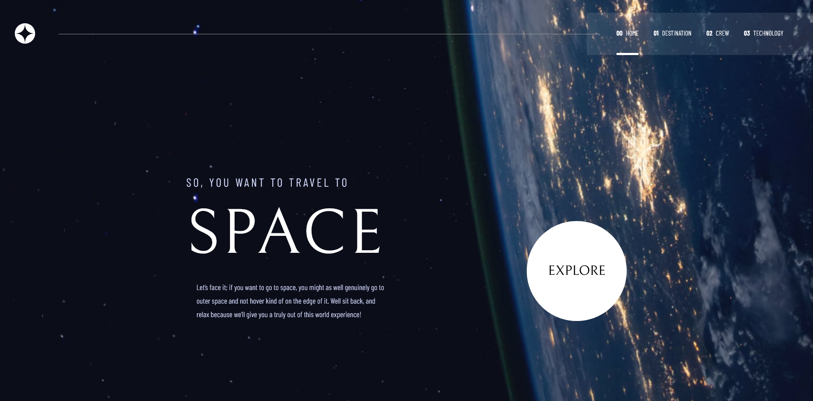

# Frontend Mentor - Space tourism website solution

This is a solution to the [Space tourism website challenge on Frontend Mentor](https://www.frontendmentor.io/challenges/space-tourism-multipage-website-gRWj1URZ3). Frontend Mentor challenges help you improve your coding skills by building realistic projects.

## Table of contents

- [Overview](#overview)
  - [The challenge](#the-challenge)
  - [Screenshot](#screenshot)
  - [Links](#links)
- [My process](#my-process)
  - [Built with](#built-with)
  - [What I learned](#what-i-learned)
  - [Continued development](#continued-development)
- [Author](#author)

**Note: Delete this note and update the table of contents based on what sections you keep.**

## Overview

### The challenge

Users should be able to:

- View the optimal layout for each of the website's pages depending on their device's screen size
- See hover states for all interactive elements on the page
- View each page and be able to toggle between the tabs to see new information

### Screenshot

### Links

- Solution URL: [space tourism website](https://shiiron-space-tourism.netlify.app)

## My process

First, taking a look at the design system in figma and create as many component as needed for the project
From the design system, trying to create all the generic css class to use
Work on each page by:

- implementing all the content
- adding and correcting layout
- adding interaction
- Fix all the responsive layout

### Built with

- HTML
- CSS Grid and Flexbox
- Figma
- Typescript
- Mobile-first workflow
- [Angular](https://angular.io/) - Angular 11

### What I learned

I learned a lot during this project, especially regarding css grid, which i found hard to grasp at first. But the more you play around with it, the more you realize how powerful it is

I learned more about font configuration such as letter-spacing

Even if i feel like angular was a bit too much for this kind of light project, it is still really interesting to see how to organize code and component to make the most out of it

i'm glad i worked on this project and it's a really awesome opportunity. It was fun and rewarding to do. It's far from perfect but i sure will aim to code better and faster from now on !

### Continued development

One of the many things i will always look for to improve i how to properly use scss in all its glory.
Implementing true responsive fonts and being able to setup cleaner project (such as utility classes and mixins)

Improving on naming and organizing css for better reading and understanding when working in a team. I might try to come back from time to time
to clean it up more and fixing a bunch of issues i find.

I will implement a small menu to navigate toward project i have done for frontend-mentor

## Author

- Frontend Mentor - [@Shiiron](https://www.frontendmentor.io/profile/Shiiron)
